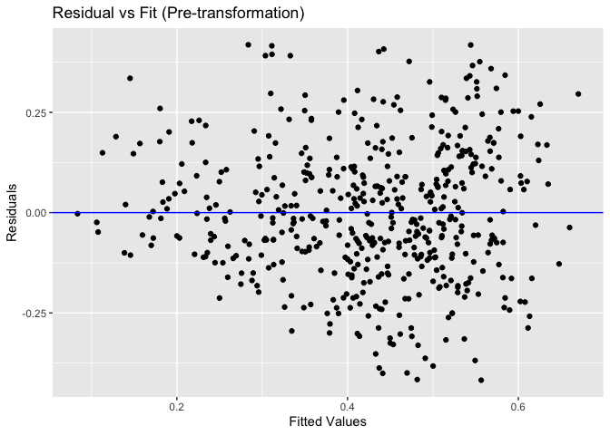

Building a Multiple Linear Regression Model to Predict a Song’s Valence
================
Srey Sea
7/1/2020

This project builds a multiple linear regression from songs’ audio
features and will predict a song’s valence in order to answer the
question:

###### Is song’s audio features to build a good linear regression model in order to predict a song’s valence?

The data is provided by Spotify and a Python script was created and used
to collect the
[dataset](https://github.com/spsea92/linear-regression/blob/master/dataset.csv)
that is used in this project.

## Predictor Variables Selection

First, the predictor variables need to be chosen.

Loading the songs dataset.

``` r
mydata = read.csv("dataset.csv")
attach(mydata)
```

The dataset has the following parameters:

``` r
library(broom)
names(mydata)
```

    ##  [1] "X"                "song"             "artist"           "danceability"    
    ##  [5] "energy"           "key"              "loudness"         "mode"            
    ##  [9] "speechiness"      "acousticness"     "instrumentalness" "liveness"        
    ## [13] "valence"          "tempo"            "type"             "id"              
    ## [17] "uri"              "track_href"       "analysis_url"     "duration_ms"     
    ## [21] "time_signature"

The method of the **best subsets regression with adjusted
R<sup>2</sup>** will be used to select the predictor variables. The
model with the highest adjusted R<sup>2</sup> values and the lowest MSE
value is deemed the best model. Below shows that model \#6, which
includes danceability, energy, speechiness, acousticness, liveness, and
duration\_ms, is the best model.

``` r
library(leaps) # To use regsubsets
n = length(mydata[,1])
mod = regsubsets(cbind(danceability,energy,key,loudness,mode,speechiness,
                       acousticness,instrumentalness,liveness,tempo,
                       duration_ms,time_signature),valence)
summary.mod = summary(mod)
rss = summary.mod$rss
mses = c(rss[1]/(n-2),rss[2]/(n-3),rss[3]/(n-4),rss[4]/(n-5),rss[5]/(n-6),
         rss[6]/(n-7),rss[7]/(n-8),rss[8]/(n-9))
mses
```

    ## [1] 0.03210279 0.02992573 0.02896838 0.02870027 0.02855485 0.02850871 0.02851926
    ## [8] 0.02853920

``` r
summary.mod$adjr2
```

    ## [1] 0.2398019 0.2913548 0.3140250 0.3203740 0.3238174 0.3249102 0.3246602
    ## [8] 0.3241881

``` r
summary.mod$which
```

    ##   (Intercept) danceability energy   key loudness  mode speechiness acousticness
    ## 1        TRUE         TRUE  FALSE FALSE    FALSE FALSE       FALSE        FALSE
    ## 2        TRUE         TRUE   TRUE FALSE    FALSE FALSE       FALSE        FALSE
    ## 3        TRUE         TRUE   TRUE FALSE    FALSE FALSE       FALSE        FALSE
    ## 4        TRUE         TRUE   TRUE FALSE    FALSE FALSE       FALSE         TRUE
    ## 5        TRUE         TRUE   TRUE FALSE    FALSE FALSE        TRUE         TRUE
    ## 6        TRUE         TRUE   TRUE FALSE    FALSE FALSE        TRUE         TRUE
    ## 7        TRUE         TRUE   TRUE  TRUE    FALSE FALSE        TRUE         TRUE
    ## 8        TRUE         TRUE   TRUE  TRUE    FALSE FALSE        TRUE         TRUE
    ##   instrumentalness liveness tempo duration_ms time_signature
    ## 1            FALSE    FALSE FALSE       FALSE          FALSE
    ## 2            FALSE    FALSE FALSE       FALSE          FALSE
    ## 3            FALSE    FALSE FALSE        TRUE          FALSE
    ## 4            FALSE    FALSE FALSE        TRUE          FALSE
    ## 5            FALSE    FALSE FALSE        TRUE          FALSE
    ## 6            FALSE     TRUE FALSE        TRUE          FALSE
    ## 7            FALSE     TRUE FALSE        TRUE          FALSE
    ## 8             TRUE     TRUE FALSE        TRUE          FALSE

Interaction terms should be considered. A correlation heatmap will be
used to see the interactions amongst the variables. I used [this
tutorial](http://www.sthda.com/english/wiki/ggplot2-quick-correlation-matrix-heatmap-r-software-and-data-visualization)
to create the heatmap.

``` r
mydata2 = mydata[,c(4,5,9,10,12,20)]
cormat = round(cor(mydata2),2)
library(reshape2)
melted_cormat = melt(cormat)
get_upper_tri = function(cormat){
  cormat[lower.tri(cormat)]<- NA
  return(cormat)
}
upper_tri = get_upper_tri(cormat)
melted_cormat = melt(upper_tri, na.rm = TRUE)
library(ggplot2) # To plot using ggplot
ggheatmap = ggplot(data = melted_cormat, aes(Var2, Var1, fill = value))+
  geom_tile(color = "white")+
  scale_fill_gradient2(low = "blue", high = "red", mid = "white", 
                       midpoint = 0, limit = c(-1,1), space = "Lab", 
                       name="Pearson\nCorrelation") +
  theme_minimal()+ 
  theme(axis.text.x = element_text(angle = 45, vjust = 1, 
                                   size = 12, hjust = 1))+
  coord_fixed()
ggheatmap + 
  geom_text(aes(Var2, Var1, label = value), color = "black", size = 4) +
  theme(
    axis.title.x = element_blank(),
    axis.title.y = element_blank(),
    panel.grid.major = element_blank(),
    panel.border = element_blank(),
    panel.background = element_blank(),
    axis.ticks = element_blank(),
    legend.justification = c(1, 0),
    legend.position = c(0.6, 0.7),
    legend.direction = "horizontal")+
  guides(fill = guide_colorbar(barwidth = 7, barheight = 1,
                               title.position = "top", title.hjust = 0.5))
```

<!-- -->

The strongest correlation is between energy and acousticness, so, their
interaction term will be considered.

``` r
mod0 = lm(valence ~ danceability + energy + speechiness + acousticness 
          + liveness + duration_ms + I(energy*acousticness))
```

Next, a series of **partial F-tests** will be performed to determine the
predictor variables to be used for the final model.

Looking at the summary of the model, the parameters speechiness,
acousticness, liveness, and the interaction term seems to be
insignificant to the model as their p-value is over 0.05.

``` r
summary(mod0)
```

    ## 
    ## Call:
    ## lm(formula = valence ~ danceability + energy + speechiness + 
    ##     acousticness + liveness + duration_ms + I(energy * acousticness))
    ## 
    ## Residuals:
    ##      Min       1Q   Median       3Q      Max 
    ## -0.41096 -0.10771 -0.00938  0.11045  0.42131 
    ## 
    ## Coefficients:
    ##                            Estimate Std. Error t value Pr(>|t|)    
    ## (Intercept)              -2.714e-02  8.002e-02  -0.339 0.734630    
    ## danceability              6.304e-01  5.937e-02  10.618  < 2e-16 ***
    ## energy                    2.965e-01  7.813e-02   3.795 0.000166 ***
    ## speechiness               2.127e-01  1.185e-01   1.795 0.073295 .  
    ## acousticness              6.013e-02  7.381e-02   0.815 0.415626    
    ## liveness                 -9.294e-02  7.155e-02  -1.299 0.194522    
    ## duration_ms              -6.284e-07  1.598e-07  -3.933 9.57e-05 ***
    ## I(energy * acousticness)  7.448e-02  1.348e-01   0.553 0.580837    
    ## ---
    ## Signif. codes:  0 '***' 0.001 '**' 0.01 '*' 0.05 '.' 0.1 ' ' 1
    ## 
    ## Residual standard error: 0.169 on 496 degrees of freedom
    ## Multiple R-squared:  0.3334, Adjusted R-squared:  0.324 
    ## F-statistic: 35.43 on 7 and 496 DF,  p-value: < 2.2e-16

For the first partial F-test, we will see if *all* of the possible
insignificant parameter are, in fact, insignificant. So, the null
hypothesis is that speechiness, acousticness, liveness, and the
interaction term are insignificant.

``` r
red.mod = lm(valence ~ danceability + energy + duration_ms)
mod1 = mod0
anova(red.mod, mod1)
```

    ## Analysis of Variance Table
    ## 
    ## Model 1: valence ~ danceability + energy + duration_ms
    ## Model 2: valence ~ danceability + energy + speechiness + acousticness + 
    ##     liveness + duration_ms + I(energy * acousticness)
    ##   Res.Df    RSS Df Sum of Sq     F  Pr(>F)  
    ## 1    500 14.484                             
    ## 2    496 14.160  4   0.32408 2.838 0.02393 *
    ## ---
    ## Signif. codes:  0 '***' 0.001 '**' 0.01 '*' 0.05 '.' 0.1 ' ' 1

We see from the p-value is 0.02393, so the probability that the null
hypothesis is true is very small, and thus, at least one of parameters
(speechiness, acousticness, liveness, and the interaction term) in
question is significant.

The next series of partial F-test will test each of the parameters in
question to determine their significance.

``` r
mod2 = lm(valence ~ danceability + energy + duration_ms + speechiness)
anova(red.mod, mod2)
```

    ## Analysis of Variance Table
    ## 
    ## Model 1: valence ~ danceability + energy + duration_ms
    ## Model 2: valence ~ danceability + energy + duration_ms + speechiness
    ##   Res.Df    RSS Df Sum of Sq      F  Pr(>F)  
    ## 1    500 14.484                              
    ## 2    499 14.382  1   0.10195 3.5373 0.06058 .
    ## ---
    ## Signif. codes:  0 '***' 0.001 '**' 0.01 '*' 0.05 '.' 0.1 ' ' 1

``` r
mod3 = lm(valence ~ danceability + energy + duration_ms + acousticness)
anova(red.mod, mod3)
```

    ## Analysis of Variance Table
    ## 
    ## Model 1: valence ~ danceability + energy + duration_ms
    ## Model 2: valence ~ danceability + energy + duration_ms + acousticness
    ##   Res.Df    RSS Df Sum of Sq     F  Pr(>F)  
    ## 1    500 14.484                             
    ## 2    499 14.321  1   0.16276 5.671 0.01762 *
    ## ---
    ## Signif. codes:  0 '***' 0.001 '**' 0.01 '*' 0.05 '.' 0.1 ' ' 1

``` r
mod4 = lm(valence ~ danceability + energy + duration_ms + liveness)
anova(red.mod, mod4)
```

    ## Analysis of Variance Table
    ## 
    ## Model 1: valence ~ danceability + energy + duration_ms
    ## Model 2: valence ~ danceability + energy + duration_ms + liveness
    ##   Res.Df    RSS Df Sum of Sq      F Pr(>F)
    ## 1    500 14.484                           
    ## 2    499 14.435  1  0.048723 1.6842  0.195

``` r
mod5 = lm(valence ~ danceability + energy + duration_ms + I(energy*acousticness))
anova(red.mod, mod5)
```

    ## Analysis of Variance Table
    ## 
    ## Model 1: valence ~ danceability + energy + duration_ms
    ## Model 2: valence ~ danceability + energy + duration_ms + I(energy * acousticness)
    ##   Res.Df    RSS Df Sum of Sq     F  Pr(>F)  
    ## 1    500 14.484                             
    ## 2    499 14.314  1   0.17002 5.927 0.01526 *
    ## ---
    ## Signif. codes:  0 '***' 0.001 '**' 0.01 '*' 0.05 '.' 0.1 ' ' 1

The ANOVA tables above shows that acousticness and the interaction
between energy and acousticness should be considered in the model as
their p-value is less than 0.05, while speechiness and liveness can be
omitted.

The next partial F-test will determine the significance of acousticness
and the interaction term. If the interaction between energy and
acousticness is significant, then we will have to include acousticness
no matter the significance, but, if acousticness is found to be
significant, we do not necessarily need to include the interaction term.
We saw earlier that acousticness is significant, so, it is enough to see
if the interaction term is significant or insignificant. The ANOVA table
below shows that the interaction term is insigificant to the
model.

``` r
full.mod = lm(valence ~ danceability + energy + duration_ms + acousticness 
          + I(energy*acousticness))
red.mod1 = lm(valence ~ danceability + energy + duration_ms + acousticness)
anova(red.mod1, full.mod)
```

    ## Analysis of Variance Table
    ## 
    ## Model 1: valence ~ danceability + energy + duration_ms + acousticness
    ## Model 2: valence ~ danceability + energy + duration_ms + acousticness + 
    ##     I(energy * acousticness)
    ##   Res.Df    RSS Df Sum of Sq      F Pr(>F)
    ## 1    499 14.321                           
    ## 2    498 14.304  1  0.017563 0.6115 0.4346

Thus, the independent parameters that are in the final model are
danceability, energy, duration\_ms, and acousticness. Looking at the
summary below, all of the parameters are now significant as their
p-values are small (less than 0.05).

``` r
fit.lm = red.mod1
summary(fit.lm)
```

    ## 
    ## Call:
    ## lm(formula = valence ~ danceability + energy + duration_ms + 
    ##     acousticness)
    ## 
    ## Residuals:
    ##      Min       1Q   Median       3Q      Max 
    ## -0.41755 -0.11103 -0.01417  0.11028  0.41827 
    ## 
    ## Coefficients:
    ##                Estimate Std. Error t value Pr(>|t|)    
    ## (Intercept)  -5.136e-02  7.085e-02  -0.725   0.4689    
    ## danceability  6.468e-01  5.871e-02  11.016  < 2e-16 ***
    ## energy        3.230e-01  5.853e-02   5.518 5.53e-08 ***
    ## duration_ms  -6.337e-07  1.589e-07  -3.989 7.63e-05 ***
    ## acousticness  9.293e-02  3.902e-02   2.381   0.0176 *  
    ## ---
    ## Signif. codes:  0 '***' 0.001 '**' 0.01 '*' 0.05 '.' 0.1 ' ' 1
    ## 
    ## Residual standard error: 0.1694 on 499 degrees of freedom
    ## Multiple R-squared:  0.3258, Adjusted R-squared:  0.3204 
    ## F-statistic: 60.28 on 4 and 499 DF,  p-value: < 2.2e-16

## Influential Points

The **studentized deleted residuals** will be used to determine any
outliers. If any of the *rstudent absolute values* is greater than 3,
the data point is considered an outlier. Since none of the rstudent
values are greater than 3 or less than -3, there are no outliers.

``` r
outl = rstudent(fit.lm)
index = seq(1, length(outl), by=1)
ggplot(fit.lm, aes(x=index, y=outl)) + geom_point() + ylim(-4,4) +
            geom_hline(yintercept=-3, color="red") +
            geom_hline(yintercept=3, color="red") +
            labs(title="Studentized Deleted Residuals", x="Index", y="rstudent values")
```

<!-- -->

Next, we see that there are highly leverage points, which are the red
points.

``` r
lev = hatvalues(fit.lm)
cutoff = mean(lev)*3
ggplot(fit.lm, aes(x=lev, y=rep(0,length(lev)))) + 
  geom_point(color = ifelse(lev > cutoff,'red','black')) + ylim(-0.4,0.4) +
  geom_vline(xintercept = cutoff, color = "blue")
```

<!-- -->

To see if these points are influential points, we will fit a linear
regression model to a reduced dataset that does not contain these
flagged points. From the summary table, we see that the error nor the
adjusted R<sup>2</sup> values change much, so, these points are not
influential points and the original dataset can still be
used.

``` r
flagged_points = data.frame(mydata[which(lev > cutoff),]) # Flagged data points
reduceddata = mydata[-c(which(lev > cutoff)),] # Reduced data without highly leverage points
rd_val = reduceddata$valence
rd_dance = reduceddata$danceability
rd_enr = reduceddata$energy
rd_dur = reduceddata$duration_ms
rd_acs = reduceddata$acousticness
rd.mod = lm(rd_val ~ rd_dance + rd_enr + rd_dur + rd_acs)
summary(rd.mod)
```

    ## 
    ## Call:
    ## lm(formula = rd_val ~ rd_dance + rd_enr + rd_dur + rd_acs)
    ## 
    ## Residuals:
    ##      Min       1Q   Median       3Q      Max 
    ## -0.42285 -0.11299 -0.01285  0.11078  0.41657 
    ## 
    ## Coefficients:
    ##               Estimate Std. Error t value Pr(>|t|)    
    ## (Intercept)  2.335e-02  7.756e-02   0.301   0.7635    
    ## rd_dance     6.169e-01  6.020e-02  10.249  < 2e-16 ***
    ## rd_enr       3.231e-01  5.981e-02   5.402 1.03e-07 ***
    ## rd_dur      -9.174e-07  2.009e-07  -4.568 6.25e-06 ***
    ## rd_acs       9.698e-02  4.004e-02   2.422   0.0158 *  
    ## ---
    ## Signif. codes:  0 '***' 0.001 '**' 0.01 '*' 0.05 '.' 0.1 ' ' 1
    ## 
    ## Residual standard error: 0.1691 on 489 degrees of freedom
    ## Multiple R-squared:  0.324,  Adjusted R-squared:  0.3184 
    ## F-statistic: 58.59 on 4 and 489 DF,  p-value: < 2.2e-16

## Transformations and Linearity, Equal Variance, and Normality Conditions

Linearity, equal variance, and normality assumptions will be checked.

The residual vs. fit plot, which tests linearity and equal variance,
shows there is a bit of *fanning effect*, so the response variable,
valence, may need to be transformed. The normal Q-Q plot, which checks
normality, shows that normality appears to be met.

``` r
suppressMessages(library(tidyverse)) # To use %>% function
fit.lm %>% augment() %>%
  ggplot(., aes(x = .fitted, y = .resid)) +
  geom_point()  +
  geom_hline(yintercept = 0, col=4) +
  labs(x = 'Fitted Values', y = 'Residuals') + 
  ggtitle("Residual vs Fit (Pre-transformation)")
```

<!-- -->

``` r
fit.lm %>% augment() %>%
  ggplot(., aes(sample = .resid)) +
  stat_qq() +
  stat_qq_line(col="red") +
  ggtitle("Normal Q-Q Plot (Pre-transformation)")
```

<!-- -->

The **Box-Cox plot** method will find the best value that will be used
to raise the response variable, valence, to that value.

``` r
suppressMessages(library(MASS)) # To use Box-Cox
bc = boxcox(fit.lm,lambda = seq(-1, 1.5, length = 10))
```

<!-- -->

``` r
ind = which(bc$y == max(bc$y))
maxlambda = bc$x[ind]
maxlambda
```

    ## [1] 0.6414141

``` r
trnsf.mod = lm(valence^maxlambda ~ danceability + energy + duration_ms + acousticness)
```

Checking normality, equal variance, and linearity once again–the
residual vs. fit plot shows the points are more randomly dispersed, so,
equal variance and linearity are met, and the normal Q-Q plot appears to
show normality is satisfied. For a sanity check, the Shapiro-Wilk test
is used to check that normality is indeed met (p-value is greater than
0.05).

``` r
trnsf.mod %>% augment() %>%
  ggplot(., aes(x = .fitted, y = .resid)) +
  geom_point()  +
  geom_hline(yintercept = 0, col=4) +
  labs(x = 'Fitted Values', y = 'Residuals') + 
  ggtitle("Residual vs Fit (After transformation)")
```

<!-- -->

``` r
trnsf.mod %>% augment() %>%
  ggplot(., aes(sample = .resid)) +
  stat_qq() +
  stat_qq_line(col="red") +
  ggtitle("Normal Q-Q Plot (After transformation)")
```

<!-- -->

``` r
mod.resid = resid(trnsf.mod)
shapiro.test(mod.resid)
```

    ## 
    ##  Shapiro-Wilk normality test
    ## 
    ## data:  mod.resid
    ## W = 0.99505, p-value = 0.1068

## Conclusion

Looking at the summary of the final model, we see that the adjusted
R<sup>2</sup> is 0.3245, so, about 32.45% of the variance found in the
response variable, valence, is explained by the predictors danceability,
energy, duration of the song, and acousticness.

``` r
summary(trnsf.mod)
```

    ## 
    ## Call:
    ## lm(formula = valence^maxlambda ~ danceability + energy + duration_ms + 
    ##     acousticness)
    ## 
    ## Residuals:
    ##      Min       1Q   Median       3Q      Max 
    ## -0.44505 -0.09370 -0.00038  0.10460  0.36775 
    ## 
    ## Coefficients:
    ##                Estimate Std. Error t value Pr(>|t|)    
    ## (Intercept)   1.259e-01  6.342e-02   1.986  0.04759 *  
    ## danceability  5.754e-01  5.255e-02  10.950  < 2e-16 ***
    ## energy        3.102e-01  5.239e-02   5.921 5.96e-09 ***
    ## duration_ms  -5.973e-07  1.422e-07  -4.200 3.16e-05 ***
    ## acousticness  9.714e-02  3.493e-02   2.781  0.00562 ** 
    ## ---
    ## Signif. codes:  0 '***' 0.001 '**' 0.01 '*' 0.05 '.' 0.1 ' ' 1
    ## 
    ## Residual standard error: 0.1516 on 499 degrees of freedom
    ## Multiple R-squared:  0.3299, Adjusted R-squared:  0.3245 
    ## F-statistic:  61.4 on 4 and 499 DF,  p-value: < 2.2e-16

Based on the adjusted R<sup>2</sup> alone, we can tell that the model is
not a good model to make a prediction about a song’s valence. Thus,
audio features alone does not create a good linear regression model to
predict a song’s valence.
